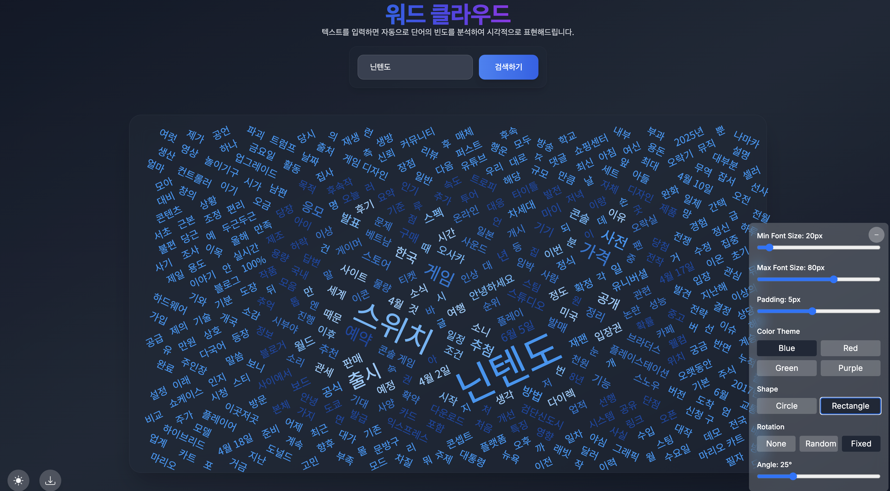

# DataPlay Project : 데이터 갖고 놀기
네이버 검색 API를 통한 을 통한 Word Cloud 만들기!

## ** 명시 사항**
- 본 코드는 오직 json 데이터 나누고 정리하고, 분석하고, 최종적으로는 해당 단어들을 사용해 워드 클라우드를 만들어 보기 위해 작성하였습니다.
- 때문에 혹시라도 불법적인 사용에 이용하시는 경우 작성자의 의도와는 무관함을 알려드립니다.

## 프로젝트 설명
- 기존 https://github.com/SeJonJ/java-Word-Cloud 프로젝트를 발전/개선 시킨 프로젝트로 기존에는 springboot 로만 개발되었던 프로젝트를 프론트 nextjs - 백엔드 springboot 로 구분하여 개발하였습니다.
- nextjs 의 경우 공부 겸 cursor + claude + 여러 MCP 를 사용한 바이브 코딩 형식으로 개발하였습니다.

## 프로젝트 구조

- `/word-cloud-nextjs` - Next.js로 구축된 프론트엔드 애플리케이션
- `/word-cloud-springboot` - Spring Boot로 구축된 백엔드 API

## 기능

- 텍스트 입력에서 아름다운 워드 클라우드 생성
- 색상, 글꼴 및 레이아웃 사용자 정의
- 워드 클라우드 저장 및 공유
- 텍스트 빈도 및 패턴 분석

## 프로젝트 특징

1. **다크 모드 지원**
   - 사용자 선호도에 맞게 라이트/다크 모드 전환 가능
   - 시스템 설정 기반 자동 테마 적용

2. **다양한 내보내기 옵션**
   - PNG, SVG, PDF 형식으로 워드 클라우드 내보내기
   - 고품질 해상도로 이미지 저장

3. **단어 클릭 검색**
   - 워드 클라우드 내 단어 클릭 시 해당 단어로 구글 검색
   - 빠른 정보 접근성 제공

4. **다양한 시각화 옵션**
   - 다양한 클라우드 모양 (원형, 사각형 등)
   - 색상 테마 및 글꼴 크기 조정
   - 단어 회전 설정

## 시작하기

### 프론트엔드 (Next.js)

```bash
# 프로젝트 루트 디렉토리에서
cd word-cloud-nextjs

# 의존성 설치
npm install

# 개발 서버 실행 (http://localhost:3000)
npm run dev

# 또는 프로덕션 빌드 후 실행
npm run build
npm start
```

### 백엔드 (Spring Boot)

```bash
# 프로젝트 루트 디렉토리에서
cd word-cloud-springboot

# Gradle로 실행 (Windows)
gradlew bootRun

# Gradle로 실행 (Mac/Linux)
./gradlew bootRun

# 또는 JAR 파일 빌드 후 실행
./gradlew build
java -jar build/libs/word-cloud-0.0.1-SNAPSHOT.jar
```

## 사용된 기술

### 프론트엔드
- **Next.js**: React 프레임워크로 서버사이드 렌더링 지원
- **TypeScript**: 타입 안정성 확보
- **Tailwind CSS**: 유틸리티 기반 CSS 프레임워크
- **D3.js**: 데이터 시각화 라이브러리
- **React Portal**: DOM 트리 외부에 컴포넌트 렌더링

### 백엔드
- **Spring Boot**: Java 기반 백엔드 프레임워크
- **Komoran**: 한국어 형태소 분석기
- **Naver API**: 외부 데이터 수집 및 분석

## 예시 화면

### 워드 클라우드 예시

*다양한 크기와 색상으로 표현된 워드 클라우드 시각화 예시로 오른쪽 하단의 컨트롤 패널에서 세부 설정 가능*
- 폰트 크기
- 글자간 간격
- 글자 회전률

### 닌텐도 관련 워드 클라우드

*"닌텐도" 키워드로 생성된 워드 클라우드 결과물을 PNG 형식으로 내보내기한 이미지*

## 활용 기능 목록
- 네이버 검색 api 주소 : https://developers.naver.com/main/
- 데이터 파싱을 위한 Java 기반의 형태소 분석기 : https://docs.komoran.kr/ 
- d3 / d3-cloud.js

## 라이센스
MIT © SeJon-Jang